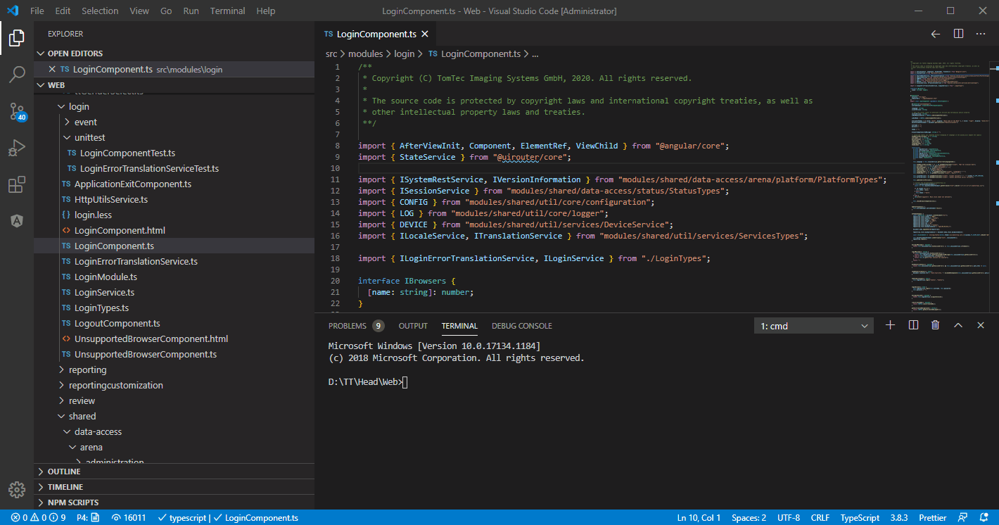
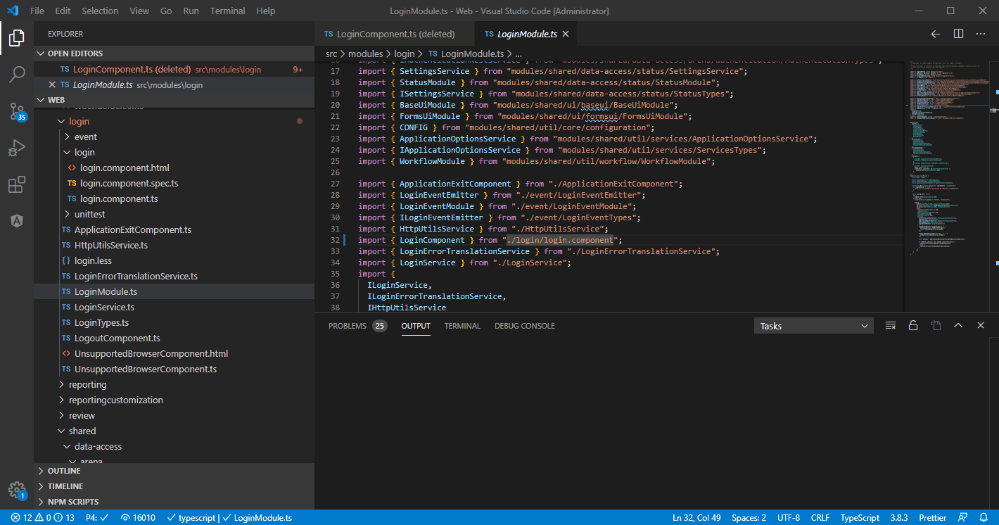

# Angularjs file renaming

This extension is used to rename files from Angularjs to Angular with the right naming convention.

## Features

Currently it support naming component, service, directive, pipe.

* `FirstSecondComponent.ts` -> `first-second/first-seconde.component.ts`
`FirstSecondComponent.html` -> `first-second/first-seconde.component.html`
`unittest/FirstSecondComponentTest.ts -> first-second/first-seconde.component.spec.ts`

* `FooService.ts -> foo.service.ts`
  `unittest/FooServiceTest.ts -> foo.service.spec.ts`

* `FistSecondDirective.ts -> first-seconde.directive.ts`
`unittest/FistSecondDirectiveTest.ts -> first-seconde.directive.spec.ts`

* `FooPipe.ts -> foo.pipe.ts`
`unittest/FooPipe.ts -> foo.pipe.spec.ts`

## Usage

1. In command palette, there will be cmdWith cmd, with `ctrl+shift+p` to open the command palette


2. In file explorer, run with menu


## Requirements

You have to connect to perforce first, and make sure 'p4' cmd work.

## Build

You have to install `vsce` first

```
$ npm install -g vsce
$ vsce package
```

## Extension Settings

No settings so far

## Known Issues

The extension is not clever enough to resolve all imported paths, you may need to resolve it by you self.

## Release Notes


### 1.0.0

Initial release of ...
